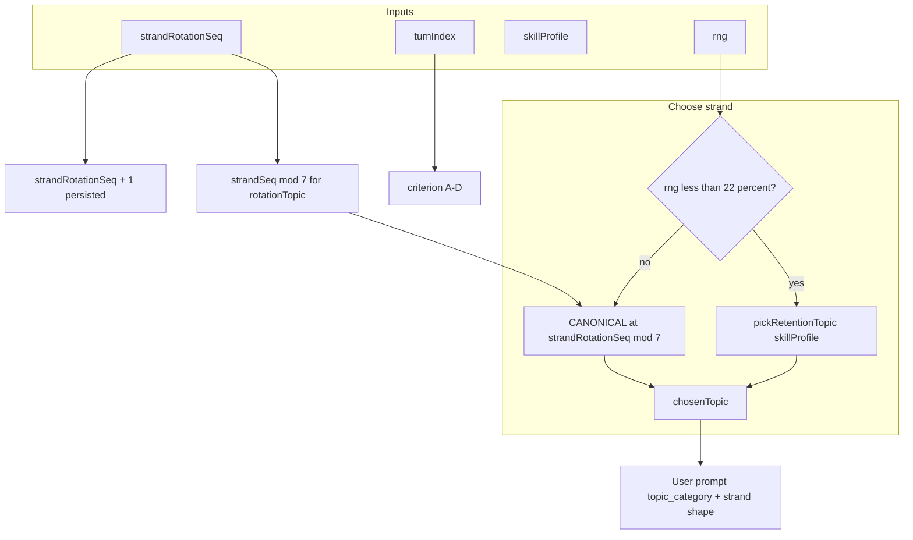

# Combat topic rotation (strand scheduling)

This document describes **how the game picks the mathematics *strand* (topic category)** for each **new combat question** request to the LLM. It does **not** describe map levels, enemy names, or shards—only the **topic rotation / retention** system.

---

## 1. Two independent axes (do not confuse them)

| Axis | What it controls | Driver | Stored / advanced |
|------|------------------|--------|-------------------|
| **MYP criterion** | Which letter (A–D) the question targets: facts, patterns, communication, or modelling | `state.turnIndex` | Increments **once per graded “Cast Spell”** (after the judge runs) |
| **Strand / topic** | Which broad syllabus area the math belongs to (Algebra, Geometry, …) | `state.strandRotationSeq` + skill profile + RNG | `strandRotationSeq` advances **once per combat question prompt build** (each time the app asks the model for a new question) |

So: you can get **Algebra** on criterion **B**, then **Geometry** on criterion **C**—the strand and the criterion letter evolve on **different clocks**.

Implementation references:

- Criterion: `buildCombatQuestionUserPrompt` uses `turnIndex` → `targetCriterion` (`js/ai/prompts/combatQuestionPedagogy.js`).
- Strand: same function uses `strandRotationSeq`, retention RNG, and `skillProfile` for `chosenTopic`.

---

## 2. Canonical strands (fixed order)

The rotation cycles through exactly these **seven** labels, in this **array order**:

```text
CANONICAL_SKILL_TOPICS (index 0 … 6)
 0  Algebra
 1  Arithmetic
 2  Geometry
 3  Fractions & Percent
 4  Patterns & Sequences
 5  Data & Probability
 6  Real-Life Modeling
```

Source: `CANONICAL_SKILL_TOPICS` in `js/ai/prompts/combatQuestionPedagogy.js`.

The **display** topic for a generated question is `topic_category` in JSON; the game may **overwrite** it with `chosenTopic` from pedagogy via `applyPedagogyLabelsToCombatQuestion` in `js/main.js` so the prompt and the stored question stay aligned.

---

## 3. `strandRotationSeq` (monotonic strand pointer)

- **Meaning:** A non-negative integer. The **rotation strand** for the *current* prompt is  
  `rotationTopic = CANONICAL_SKILL_TOPICS[strandRotationSeq % 7]`.
- **When it increments:** By **1** on **every** call path that runs `buildMathQuestionPrompt` → `buildCombatQuestionUserPrompt`, which sets  
  `state.strandRotationSeq = bundle.nextStrandRotationSeq` where `nextStrandRotationSeq = strandSeq + 1` (see `combatQuestionPedagogy.js`).
- **Important:** It increments **per question fetch**, not per battle turn in the RPG sense. A single battle can have multiple questions; each new LLM question build advances the sequence once. Prefetch for the “next” question also advances it when that prompt is built.
- **Persistence:** Saved in the player profile (`strandRotationSeq` in local profile JSON and merged with cloud in `js/main.js`) so rotation does not reset every session.

If `strandRotationSeq` is missing or invalid, it is treated as **0**.

---

## 4. Default path: **rotation** (~78% of prompts)

**Constant:** `RETENTION_FRACTION = 0.22` in `combatQuestionPedagogy.js`.

For each prompt build:

1. Draw `rng()` uniform in `[0, 1)` (in the app, `Math.random`).
2. If `rng() >= RETENTION_FRACTION` (i.e. **~78%** of the time), the strand is **rotation-only**:
   - `chosenTopic = rotationTopic = CANONICAL_SKILL_TOPICS[strandSeq % 7]`
   - The user message explains this as **ROTATION (default)** and states that the strand is driven by persisted `strandRotationSeq`.

So over many **rotation-only** draws, you walk the list in order as `strandRotationSeq` increases, modulo 7.

---

## 5. Retention path (~22% of prompts)

If `rng() < RETENTION_FRACTION` (**~22%**):

- `chosenTopic = pickRetentionTopic(skillProfile, rng)` — **not** the rotation index for that question.
- The prompt explains **RETENTION (~22%)** and still prints the **retention candidate** line for transparency.

### `pickRetentionTopic` algorithm (`combatQuestionPedagogy.js`)

1. Ensure every canonical strand exists on the profile with `{ attempts, corrects }` (`ensureCanonicalSkillTopicsInPlace`).
2. **Exploration first:** Collect strands with `attempts < SKILL_TOPIC_MIN_SAMPLES` (default **3**). If any exist, return one chosen **uniformly at random** among them.
3. Otherwise, among strands with **at least one attempt**, pick the strand with the **lowest** success ratio `corrects / attempts` (break ties by first encountered order in the loop).
4. Edge case: if no ratio is usable (e.g. all zeros), fall back to random among under-sampled or uniform random strand.

**Intent:** Early on, spread attempts across strands; later, lean toward strands the player fails more often.

---

## 6. What retention does *not* change

- **`strandRotationSeq` always advances by 1** when the prompt is built, whether the **chosen** topic came from rotation or retention. So the **next** rotation slot is always updated; you do not “skip a turn” on the rotation counter when retention fires.
- **Retention does not use the map level** to pick the strand; difficulty band still comes from `mapLevel` / `forceEasierNextQuestion` in the same prompt.

---

## 7. Skill profile (feeds retention only)

`state.skillProfile` holds per-topic `attempts` and `corrects` for canonical labels.

**Updates:** `recordCombatSkillOutcome` in `js/main.js` runs after a graded cast:

- Maps `question.topic_category` through `canonicalizeReportedTopic` (handles legacy phrasing).
- `attempts += 1` always.
- `corrects += 1` only if the judge band is `correct_with_reasoning` or `correct_no_reasoning`.

So **partial / incorrect** answers still count as attempts for retention sampling, but do not increase `corrects`.

---

## 8. Strand *shape* (constraints sent to the model)

Regardless of rotation vs retention, the prompt includes **`strandShapeRequirement(chosenTopic)`**: a one-line description of what the **math** must look like for that strand (e.g. Geometry must be essential, not decoration). This reduces “everything is algebra in a shopping story” drift.

---

## 9. Prompt bundle metadata (`buildCombatQuestionUserPrompt` return value)

The builder returns (among other fields):

| Field | Role |
|-------|------|
| `chosenTopic` | Strand label used for `topic_category` in the user message |
| `targetCriterion` | A/B/C/D from `turnIndex` |
| `nextStrandRotationSeq` | `strandSeq + 1` to persist |
| `meta.rotationTopic` | What the rotation index would have been *that* request |
| `meta.retentionTopic` | Result of `pickRetentionTopic` (always computed for the prompt text) |
| `meta.usedRetention` | Whether this draw used retention (`rng < 0.22`) |
| `meta.strandSeq` | Snapshot of the input `strandRotationSeq` used for that prompt |

---

## 10. Wire-up in the game (`js/main.js`)

1. **`buildMathQuestionPrompt`** reads `state.strandRotationSeq`, `state.turnIndex`, `state.skillProfile`, `state.activeQuestion?.text`, etc., calls `buildCombatQuestionUserPrompt`, then **writes** `state.strandRotationSeq = bundle.nextStrandRotationSeq` and may save the profile.
2. **`fetchQuestionViaDashScope`** receives the pedagogy object and calls `applyPedagogyLabelsToCombatQuestion` so the parsed JSON’s `topic_category` / `criterion` match the bundle.
3. Prefetch and in-battle fetches both use the same pipeline, so rotation advances whenever **any** new combat question prompt is built for that flow.

---

## 11. Summary diagram



---

## 12. Files to read when changing this behavior

| File | Responsibility |
|------|------------------|
| `js/ai/prompts/combatQuestionPedagogy.js` | `CANONICAL_SKILL_TOPICS`, retention fraction, `pickRetentionTopic`, `buildCombatQuestionUserPrompt`, `strandShapeRequirement` |
| `js/main.js` | `buildMathQuestionPrompt`, `recordCombatSkillOutcome`, profile merge for `strandRotationSeq` |
| `js/state.js` | Default `strandRotationSeq: 0` in `state` |

CLI / validation tools that rebuild the same user prompt (e.g. `scripts/validate-llm.mjs`) should pass the same `strandRotationSeq` and skill snapshot so behaviour matches the browser.
